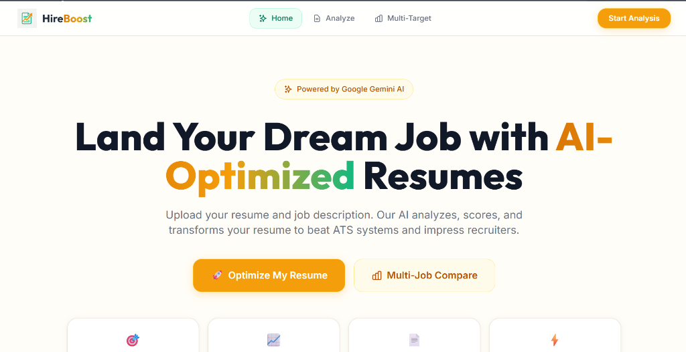

<p align="center">
  
</p>

<h1 align="center">HireBoost</h1>

<p align="center">
  An AI-powered resume optimizer built to help job seekers improve resume quality, increase ATS score, and tailor resumes for different job roles.
</p>

<p align="center">
  
  
  
  
</p>

## About The Project

HireBoost is a full-stack web application that helps users improve their resumes based on a target job description.

With this app, a user can:

- upload a resume PDF or paste resume text
- paste a job description
- get ATS score and keyword match analysis
- view missing skills and improvement suggestions
- generate an optimized resume using AI
- compare one resume with multiple job descriptions
- export resume content as LaTeX for Overleaf

I built this project to make resume tailoring easier, faster, and more practical for students and job seekers.

## Screenshots

### Home Page

<p align="center">
  
</p>

## Features

- Resume upload using PDF
- Manual resume text input
- Job description analysis
- ATS score breakdown
- Present and missing keyword detection
- Bullet point improvement suggestions
- AI-generated optimized resume
- Multi-job resume comparison
- LinkedIn profile text import
- LaTeX export support
- Resume history storage when MongoDB is connected

## Tech Stack

### Frontend

- React
- Vite
- Tailwind CSS
- Framer Motion
- React Router
- Axios

### Backend

- Node.js
- Express
- Multer
- pdf-parse
- Mongoose
- Google Gemini API

## Folder Structure

```text
HireBoost/
|-- client/
|   |-- public/
|   |-- src/
|   |   |-- components/
|   |   |-- pages/
|   |   `-- services/
|-- server/
|   |-- config/
|   |-- controllers/
|   |-- middleware/
|   |-- models/
|   |-- routes/
|   `-- services/
|-- test_latex.js
`-- README.md
```

## How It Works

1. The user uploads a resume PDF or pastes resume text.
2. The user pastes a target job description.
3. The backend extracts resume text if a PDF is uploaded.
4. The app compares resume keywords with the job description.
5. Gemini provides deeper analysis, suggestions, and optimization.
6. The user gets ATS score, keyword gaps, bullet improvements, and feedback.
7. The user can also generate an optimized resume and export it as LaTeX.

## Environment Variables

Create a root `.env` file and add:

```env
GEMINI_API_KEY=your_gemini_api_key
MONGODB_URI=your_mongodb_connection_string
PORT=5000
GEMINI_MODEL=gemini-2.5-flash
GEMINI_MAX_RETRIES=3
CORS_ALLOWED_ORIGINS=https://your-frontend.vercel.app
```

Notes:

- `GEMINI_API_KEY` is required.
- `MONGODB_URI` is optional.
- if MongoDB is not connected, the app still runs but history will not be saved.
- `PORT` defaults to `5000`.
- `CORS_ALLOWED_ORIGINS` is used in production to allow your frontend domain.

Create `client/.env` for local frontend setup:

```env
VITE_API_URL=http://localhost:5000/api
```

For production, set `VITE_API_URL` in your frontend deployment settings.

## Installation

### 1. Clone the repository

```bash
git clone <your-repo-url>
cd HireBoost
```

### 2. Install backend dependencies

```bash
cd server
npm install
```

### 3. Install frontend dependencies

```bash
cd ../client
npm install
```

## Run Locally

Open two terminals.

### Start backend

```bash
cd server
npm run dev
```

### Start frontend

```bash
cd client
npm run dev
```

Local URLs:

- Frontend: `http://localhost:5173`
- Backend: `http://localhost:5000`
- Health check: `http://localhost:5000/api/health`

## Available Scripts

### Backend

```bash
npm run dev
npm start
```

### Frontend

```bash
npm run dev
npm run build
npm run preview
npm run lint
```

## API Endpoints

| Method | Endpoint | Description |
| --- | --- | --- |
| GET | `/api/health` | Check backend status |
| POST | `/api/resume/analyze` | Analyze resume against one job description |
| POST | `/api/resume/optimize` | Generate optimized resume |
| POST | `/api/resume/multi-target` | Compare resume against multiple job descriptions |
| POST | `/api/resume/linkedin-import` | Convert LinkedIn text into resume format |
| POST | `/api/resume/export/latex` | Generate LaTeX output |
| GET | `/api/resume/history` | Fetch saved history |

## Deployment Notes

- deploy frontend and backend separately if needed
- set `VITE_API_URL` in frontend deployment
- set `GEMINI_API_KEY` in backend deployment
- set `CORS_ALLOWED_ORIGINS` in backend deployment to your frontend domain
- add `MONGODB_URI` if you want history saving

## Common Issues

### Backend not starting

Make sure `GEMINI_API_KEY` is present in the root `.env` file.

### History not saving

Check your MongoDB connection. The app works without MongoDB, but history will stay empty.

### Frontend cannot connect to backend

Check these things:

- `VITE_API_URL` is correct
- backend is running
- frontend domain is included in `CORS_ALLOWED_ORIGINS`

### PDF upload not working

Only PDF files are supported, and the file size must be under 5 MB.

## Future Improvements

- user authentication
- PDF export download
- better resume templates
- dashboard for saved resumes
- more detailed AI suggestions

## License

This project is licensed under the MIT License.
